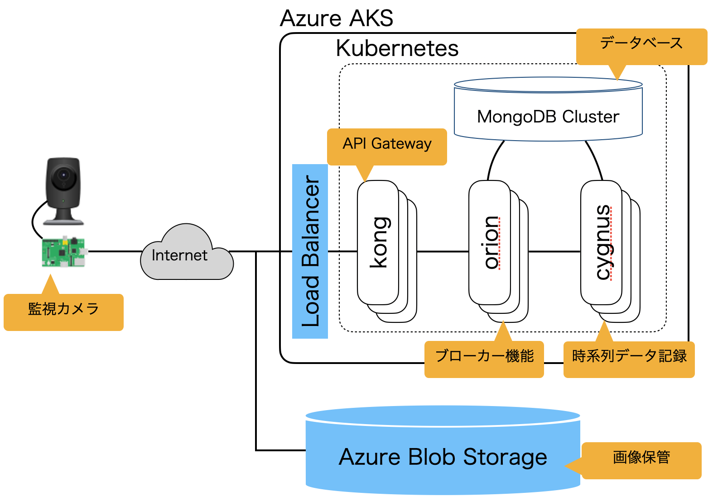

# qiita\_fiware\_camera
A demonstration to build a FIWARE platform that works with Azure Blob Storage to record images captured by IoT cameras.



## Getting started
### set your variable
1. copy `variables/env.temp` to `variables/env`, and edit variables to your own.

### start Azure managed services
1. log in Azure

    ```bash
    $ ./installation/01_azure_login.sh
    ```
1. create resource group

    ```bash
    $ ./installation/02_azure_create_resourcegroup.sh
    ```
1. start Azure AKS

    ```bash
    $ ./installation/03_azure_start_aks.sh
    ```
    <details><summary>RESULT</summary><div>

    ```bash
    $ kubectl get nodes
    NAME                                STATUS   ROLES   AGE     VERSION
    aks-nodepool1-14606101-vmss000000   Ready    agent   7m12s   v1.24.0
    aks-nodepool1-14606101-vmss000001   Ready    agent   7m14s   v1.24.0
    aks-nodepool1-14606101-vmss000002   Ready    agent   7m17s   v1.24.0
    ```
    <div></details>
1. start Azure Blob Storage

    ```bash
    $ ./installation/04_azure_blobstorage.sh
    ```
### start MongoDB on Azure AKS
1. start MongoDB Pods

    ```bash
    $ ./installation/05_fiware_start_mongodb.sh
    ```
    <details><summary>RESULT</summary><div>

    ```bash
    $ kubectl get pods -l app.kubernetes.io/name=mongodb
    NAME        READY   STATUS    RESTARTS   AGE
    mongodb-0   1/1     Running   0          2m55s
    mongodb-1   1/1     Running   0          2m
    mongodb-2   1/1     Running   0          65s
    ```
    <div></details>
1. construct MongoDB cluster

    ```bash
    $ ./installation/06_fiware_setup_mongodb.sh
    ```
    <details><summary>RESULT</summary><div>

    ```bash
    [
      {
        name: 'mongodb-0.mongodb-headless.default.svc.cluster.local:27017',
        stateStr: 'PRIMARY'
      },
      {
        name: 'mongodb-1.mongodb-headless.default.svc.cluster.local:27017',
        stateStr: 'SECONDARY'
      },
      {
        name: 'mongodb-2.mongodb-headless.default.svc.cluster.local:27017',
        stateStr: 'SECONDARY'
      }
    ]
    ```
    <div></details>
### start FIWARE components
1. after started MongoDB Cluster, start FIWARE Orion

    ```bash
    $ ./installation/07_fiware_start_orion.sh
    ```
    <details><summary>RESULT</summary><div>

    ```bash
    $ kubectl get pods -l app=orion
    NAME                     READY   STATUS    RESTARTS   AGE
    orion-54c98d69c7-4tjmh   1/1     Running   0          4m48s
    orion-54c98d69c7-964st   1/1     Running   0          4m48s
    orion-54c98d69c7-kgxrl   1/1     Running   0          4m48s
    ```
    <div></details>
1. after started MongoDB Cluster and FIWARE Orion, start FIWARE Cygnus

    ```bash
    $ ./installation/08_fiware_start_cygnus.sh
    ```
    <details><summary>RESULT</summary><div>

    ```bash
    $ kubectl get pods -l app=cygnus
    NAME                      READY   STATUS    RESTARTS   AGE
    cygnus-6dc69bdd9f-l6kql   1/1     Running   0          105s
    cygnus-6dc69bdd9f-pzplw   1/1     Running   0          105s
    cygnus-6dc69bdd9f-w8dss   1/1     Running   0          105s
    ```
    <div></details>
### start API Gateway
1. after started FIWARE components, start kong

    ```bash
    $ ./installation/09_kong_start_kong.sh
    ```
    <details><summary>RESULT</summary><div>

    ```bash
    $ kubectl -n kong get pods
    NAME                            READY   STATUS    RESTARTS   AGE
    ingress-kong-6454f9b96b-nbfsp   2/2     Running   0          4m52s
    ingress-kong-6454f9b96b-xz6mh   2/2     Running   0          4m52s
    ingress-kong-6454f9b96b-zx9qw   2/2     Running   0          4m52s
    ```
    ```bash
    $ kubectl -n kong get services
    NAME                      TYPE           CLUSTER-IP     EXTERNAL-IP       PORT(S)                      AGE
    kong-proxy                LoadBalancer   10.0.104.182   xxx.xxx.xxx.xxx   80:31629/TCP,443:30182/TCP   3m31s
    kong-validation-webhook   ClusterIP      10.0.37.181    <none>            443/TCP   
    ```
    <div></details>
1. register A Record to Azure DNS, and get TLS certification from Let's Encrypt

    ```bash
    $ ./installation/10_kong_start_cert-manager.sh
    ```
1. set the routing and security definitions

    ```bash
    $ ./installation/11_kong_setup_kong.sh
    ```
    <details><summary>RESULT</summary><div>

    ```bash
    $ curl -i http://fiware-camera.example.com/
    HTTP/1.1 404 Not Found
    Date: Sun, 26 Jun 2022 13:25:25 GMT
    Content-Type: application/json; charset=utf-8
    Connection: keep-alive
    Content-Length: 48
    X-Kong-Response-Latency: 0
    Server: kong/2.8.1

    {"message":"no Route matched with those values"}
    ```
    ```bash
    $ curl -i http://fiware-camera.example.com/version
    HTTP/1.1 301 Moved Permanently
    Date: Sun, 26 Jun 2022 13:26:10 GMT
    Content-Type: text/html
    Content-Length: 134
    Connection: keep-alive
    Location: https://fiware-camera.example.com/version
    X-Kong-Response-Latency: 0
    Server: kong/2.8.1

    <html>
    <head><title>301 Moved Permanently</title></head>
    <body>
    <center><h1>301 Moved Permanently</h1></center>
    </body>
    </html>
    ```
    ```bash
    $ curl -i https://fiware-camera.example.com/version
    HTTP/2 401
    date: Sun, 26 Jun 2022 13:26:37 GMT
    content-type: application/json; charset=utf-8
    www-authenticate: Key realm="kong"
    content-length: 45
    x-kong-response-latency: 0
    server: kong/2.8.1

    {
      "message":"No API key found in request"
    }
    ```
    ```bash
    $ curl -i -H "Authorization: ${API_TOKEN}" https://fiware-camera.example.com/version
    HTTP/2 200
    content-type: application/json
    content-length: 656
    fiware-correlator: f3fe3f82-f553-11ec-82c3-4a55b25ab823
    date: Sun, 26 Jun 2022 13:29:06 GMT
    x-kong-upstream-latency: 4
    x-kong-proxy-latency: 2
    via: kong/2.8.1

    {
    "orion" : {
      "version" : "3.4.0",
      "uptime" : "0 d, 0 h, 48 m, 20 s",
      "git_hash" : "e8ed9c5f363ab503ac406a9e62a213640d9c2864",
      "compile_time" : "Tue Dec 14 09:34:09 UTC 2021",
      "compiled_by" : "root",
      "compiled_in" : "5221bc0800ef",
      "release_date" : "Tue Dec 14 09:34:09 UTC 2021",
      "machine" : "x86_64",
      "doc" : "https://fiware-orion.rtfd.io/en/3.4.0/",
      "libversions": {
         "boost": "1_66",
         "libcurl": "libcurl/7.61.1 OpenSSL/1.1.1k zlib/1.2.11 nghttp2/1.33.0",
         "libmosquitto": "2.0.12",
         "libmicrohttpd": "0.9.70",
         "openssl": "1.1",
         "rapidjson": "1.1.0",
         "mongoc": "1.17.4",
         "bson": "1.17.4"
      }
    }
    }
    ```
    <div></details>
### set up FIWARE Entity and Subscription
1. register Entity

    ```bash
    $ ./setup/01_create_camera_entity.sh
    ```
1. register Subscription

    ```bash
    $ ./setup/02_subscribe_camera_entity.sh
    ```
### set up IoT Camera
1. install python 3.10 and [poetry](https://cocoatomo.github.io/poetry-ja/)
1. install libraries required to run OpenCV4
1. install [rust](https://www.rust-lang.org/) so that [cryptography](https://pypi.org/project/cryptography/) can be built
1. copy [camera\_client](/tree/main/camera_client) directory to IoT Camera
1. copy env file to IoT Camera
1. obtain the **connection string** to connect to Azure Blob Storage

    ```bash
    $ ./variables/01_azure_storage_connectionstring.sh
    ```
1. log in to IoT Camera
1. install python libraries to IoT Camera

    ```bash
    $ poetry install
    ```
### send images captured by the IoT Camera to Azure Blob Storage and FIWARE
1. activate the python virtual environment

    ```bash
    $ poetry shell
    ```
1. load environment variables from env file

    ```bash
    $ set -a;source ~/env; set +a
    ```
1. set connection string as an environment variable

    ```bash
    $ export AZURE_STORAGE_CONNECTION_STRING="...................<<your connection string>>...................."
    ```
1. start the capture command on IoT Camera

    ```bash
     ./main.py
    ```

## License

[MIT License](/LICENSE)

## Copyright
Copyright (c) 2021 [Nobuyuki Matsui](mailto:nobuyuki.matsui@gmail.com)

